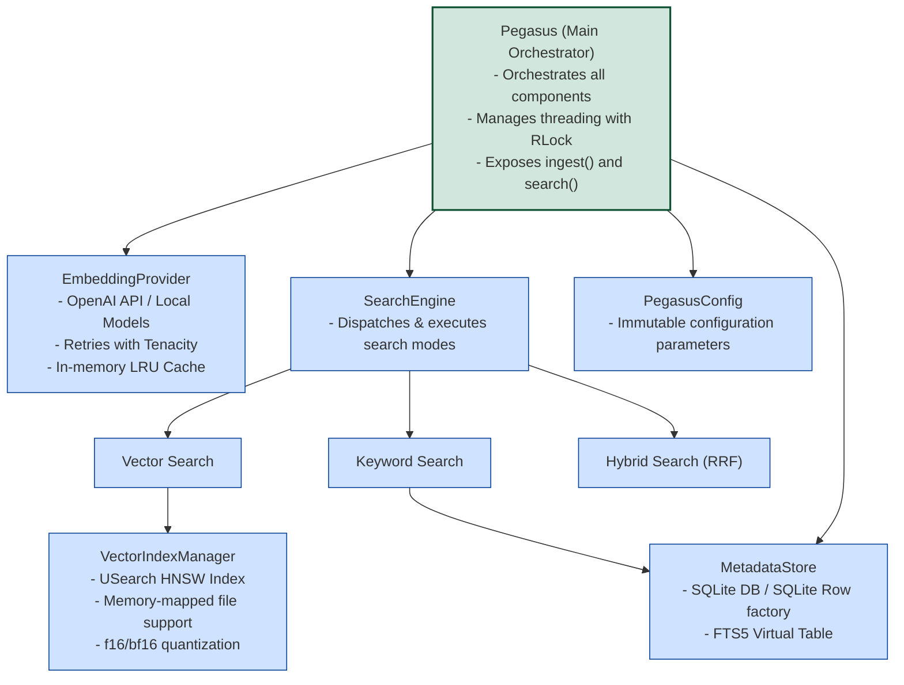
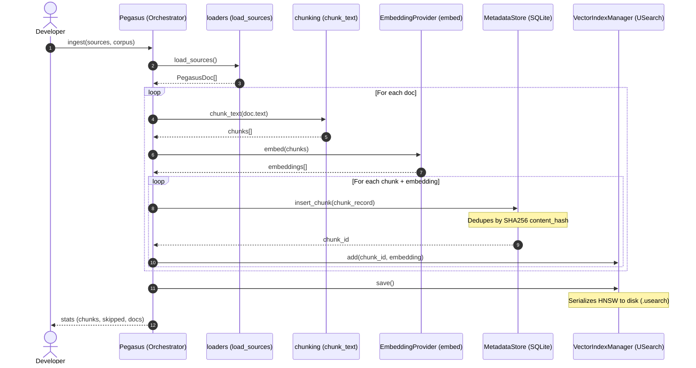

# Pegasus Architecture Guide

## Codebase Organization

```
pegasus/
├── pegasus/                    # Main package
│   ├── __init__.py            # Public API exports
│   ├── config.py              # Configuration (immutable)
│   ├── models.py              # Data classes (PegasusDoc, SearchResult)
│   ├── loaders.py             # Multi-source document loading
│   ├── chunking.py            # Text chunking strategies
│   ├── embeddings.py          # OpenAI embedding provider
│   ├── index.py               # USearch HNSW vector index
│   ├── storage.py             # SQLite + FTS5 metadata
│   ├── search.py              # Search dispatcher (3 modes)
│   ├── pegasus.py             # Main orchestrator + factory
│   └── cli.py                 # Demo/CLI entry point
├── pegasus_v2.py              # Original monolithic version (legacy)
├── setup.py                   # Package metadata & installation
├── README.md                  # User guide & benchmarks
├── QUICK_START.md             # 5-minute examples
├── STRUCTURE.md               # Module reference
└── ARCHITECTURE.md            # This file
```

## Separation of Concerns

Each module has **exactly one reason to change**:

| Module | Responsibility | Change Reason |
|--------|---|---|
| `config.py` | Configuration schema | Change default settings or add new parameters |
| `models.py` | Data types | Add fields to results/documents |
| `loaders.py` | Read from disk/web | Support new file formats or loaders |
| `chunking.py` | Split text | Improve chunking algorithm |
| `embeddings.py` | Call embedding API | Switch to different embedding provider |
| `index.py` | Vector index operations | Switch vector DB implementation |
| `storage.py` | Store metadata | Change SQLite schema or indexing strategy |
| `search.py` | Rank and combine results | Add new search mode or ranking algorithm |
| `pegasus.py` | Orchestrate components | Change overall flow or add new methods |

## Component Diagram



## Data Flow

### Ingestion Pipeline



### Search Pipeline

```mermaid
flowchart TD
    Query([Query String]) --> Search[Pegasus.search]
    Search --> ModeCheck{Check Mode}

    %% Vector Search Branch
    ModeCheck -- "vector" --> VecSearch[SearchEngine.vector_search]
    VecSearch --> VecEmbed[EmbeddingProvider.embed query] --> QueryVector[Query Vector]
    QueryVector --> IndexSearch[VectorIndexManager.search] --> HNSWMatches[HNSW Matches k nearest]
    HNSWMatches --> FetchMetadata[MetadataStore.get_chunk for matches]
    FetchMetadata --> FilterMetadata{Apply filters?}
    FilterMetadata -- Yes --> FilterPass{Passes filter_fn?}
    FilterMetadata -- No --> NormaliseDist[Convert distance to similarity 0-1]
    FilterPass -- Yes --> NormaliseDist
    FilterPass -- No --> DiscardVec[Discard chunk]
    NormaliseDist --> ReturnVec[SearchResult[] sorted by score]

    %% Keyword Search Branch
    ModeCheck -- "keyword" --> KeySearch[SearchEngine.keyword_search]
    KeySearch --> EscapedQuery[escape_fts5_query]
    EscapedQuery --> FTSSearch[MetadataStore.search_fts] --> Rows[SQLite FTS5 Rows BM25 ranked]
    Rows --> FilterFTS{Apply filters?}
    FilterFTS -- Yes --> FilterPassFTS{Passes filter_fn?}
    FilterFTS -- No --> NormalizeRank[Normalize negative rank score]
    FilterPassFTS -- Yes --> NormalizeRank
    FilterPassFTS -- No --> DiscardFTS[Discard chunk]
    NormalizeRank --> ReturnKey[SearchResult[]]

    %% Hybrid Search Branch
    ModeCheck -- "hybrid" --> Hybrid[SearchEngine.hybrid_search]
    Hybrid --> CallVec[vector_search k * 2]
    Hybrid --> CallKey[keyword_search k * 2]
    CallVec --> RRF[Reciprocal Rank Fusion RRF]
    CallKey --> RRF
    RRF --> CalcRRF[Score = alpha / 60+v_rank + 1-alpha / 60+k_rank]
    CalcRRF --> SortRRF[Sort and return top k] --> ReturnHybrid[SearchResult[]]
```

## Thread Safety

```
Pegasus
├── _lock: RLock (reentrant)
├── ingest()
│   └── with self._lock:
│       ├── All component operations
│       ├── SQLite writes
│       └── Index updates
└── search()
    └── with self._lock:
        └── Read-only operations (safe to parallelize)
```

**Why RLock?**
- Same thread can acquire lock multiple times
- Needed for nested method calls
- Allows concurrent searches (all hold read lock)

## Configuration Hierarchy

```
PegasusConfig (dataclass)
├── Embedding settings
│   ├── embedding_model: str
│   └── embedding_dim: int
├── HNSW Index parameters
│   ├── metric: str ("cos", "ip", "l2sq")
│   ├── dtype: str ("f32", "f16", "bf16", "i8")
│   ├── connectivity: int (M parameter)
│   ├── expansion_add: int (efConstruction)
│   └── expansion_search: int (ef)
├── Chunking settings
│   ├── chunk_size: int (tokens)
│   ├── chunk_overlap: int (tokens)
│   └── chunk_strategy: str ("sentence", "paragraph", "fixed")
├── Search defaults
│   ├── default_k: int
│   └── hybrid_alpha: float
└── Storage paths
    ├── db_path: str
    └── index_path: str
```

All settings are immutable after creation. To change:
```python
# Create new config
config = PegasusConfig(dtype="f32", connectivity=64)
# Create new engine
pegasus = Pegasus(config)
```

## Memory Layout

### Vector Index (USearch)
```
HNSW Index File (.usearch)
├── Header (magic, version, params)
├── Nodes layer 0 (all vectors)
├── Nodes layer 1 (subset)
├── Nodes layer 2 (smaller subset)
└── ... (decreasing density by layer)

For 1M vectors × 3072 dims:
- f32: ~12 GB
- f16: ~6 GB (2x savings)
- i8:  ~3 GB (aggressive)
```

### Metadata (SQLite)
```
Database File (.db)
├── chunks table
│   ├── id, corpus, doc_id (indexed)
│   ├── chunk_index, content
│   ├── content_hash (unique, for dedup)
│   ├── source, title, page
│   └── metadata_json
└── chunks_fts (FTS5 index on content)

For 1M chunks:
- ~500 MB - 2 GB (depends on avg content length)
```

## Extension Points

### 1. Custom Embedding Provider
```python
from pegasus.embeddings import EmbeddingProvider

class MyEmbedder(EmbeddingProvider):
    def embed(self, texts):
        # Your logic: load model, tokenize, forward, etc.
        return embeddings

# Use in Pegasus
pegasus.embedder = MyEmbedder("my-model")
```

### 2. Custom Chunking
```python
from pegasus.chunking import chunk_text

# Option A: Add to chunk_text()
def chunk_text(text, *, max_chars=2000, overlap_chars=200, strategy="sentence"):
    if strategy == "semantic":
        # Your semantic chunking logic
        pass

# Option B: Call directly
my_chunks = my_chunking_algorithm(text)
for embedding in embedder.embed(my_chunks):
    index.add(chunk_id, embedding)
```

### 3. Custom Search Mode
```python
from pegasus.search import SearchEngine

class MySearchEngine(SearchEngine):
    def custom_search(self, query, k=10):
        # Combine multiple ranking algorithms
        return results

# Use in Pegasus
pegasus.search_engine = MySearchEngine(...)
```

### 4. Custom Metadata Filtering
```python
# Built-in
results = pegasus.search(
    "query",
    filter_fn=lambda m: m.get("source") in ["trusted"]
)

# For more complex: post-process
results = pegasus.search("query", k=100)
results = [r for r in results if my_complex_filter(r)]
results = results[:10]
```

## Performance Tuning

### Indexing Speed
```python
# Slower but better index quality
config = PegasusConfig(
    expansion_add=256,  # Default 128
)

# Faster but lower quality
config = PegasusConfig(
    expansion_add=64,   # Default 128
)
```

### Search Speed vs Recall
```python
# Faster but lower recall
config = PegasusConfig(
    expansion_search=32,  # Default 64
)

# Slower but higher recall
config = PegasusConfig(
    expansion_search=256,  # Default 64
)
```

### Memory Usage
```python
# 2x smaller index
config = PegasusConfig(dtype="f16")  # vs f32

# Fewer edges in graph
config = PegasusConfig(connectivity=16)  # vs 32
```

## Common Customizations

### Multi-Language Support
```python
# Use multilingual embeddings
config = PegasusConfig(
    embedding_model="text-embedding-3-large",  # multilingual
    embedding_dim=3072
)
```

### Domain-Specific Chunking
```python
# Medical documents: split on sentence boundaries
config = PegasusConfig(chunk_strategy="sentence", chunk_size=256)

# Code files: split on functions
config = PegasusConfig(chunk_strategy="custom")  # implement in chunking.py
```

### Tiered Metadata
```python
# Store hierarchy in metadata
doc = PegasusDoc(
    text="...",
    metadata={
        "source": "docs",
        "title": "Quick Start",
        "section": "Installation",
        "subsection": "Prerequisites",
        "level": 3,
    }
)

# Filter by level
results = pegasus.search(
    "query",
    filter_fn=lambda m: m.get("level", 0) <= 2
)
```

## Deployment Patterns

### Single-Process (Development)
```python
pegasus = create_pegasus("db.db", "index.usearch")
pegasus.search("query")  # Blocks until done
```

### Multi-Process (Production)
```python
# Worker 1: Ingest
pegasus1 = Pegasus(config)
pegasus1.ingest(docs)

# Worker 2+: Search (read-only)
pegasus2 = Pegasus(config)
pegasus2.index_manager._init_index(view_only=True)  # Memory-mapped
pegasus2.search("query")  # Doesn't block others
```

### Multi-Index Sharding
```python
# For 1B+ vectors
shards = [
    Pegasus(PegasusConfig(index_path=f"shard_{i}.usearch"))
    for i in range(10)
]

# Search all shards
all_results = []
for shard in shards:
    all_results.extend(shard.search(query, k=10))

# Merge and rank top k
top_k = sorted(all_results, key=lambda x: x.score, reverse=True)[:10]
```

## Testing Strategy

Each component can be tested in isolation:

```python
# config.py
assert PegasusConfig().dtype == "f16"

# models.py
doc = PegasusDoc(text="hello")
assert len(doc.doc_id) == 16

# chunking.py
chunks = chunk_text("a. b. c.", strategy="sentence")
assert len(chunks) == 3

# storage.py (with :memory: SQLite)
store = MetadataStore(":memory:")
chunk_id = store.insert_chunk({...})
assert chunk_id > 0

# index.py (with temporary files)
index = VectorIndexManager("/tmp/test.usearch", 3072)
index.add(1, [0.0] * 3072)
assert len(index) == 1

# search.py (mocked components)
# Test RRF scoring, filtering logic

# Integration tests with real API (require OPENAI_API_KEY)
pegasus = create_pegasus()
docs = [PegasusDoc(text="hello world")]
stats = pegasus.ingest(docs)
assert stats["chunks"] > 0
```

## Future Enhancements

- [ ] Async/streaming ingestion
- [ ] Incremental updates (upsert, delete chunks)
- [ ] Built-in query expansion (synonyms, related terms)
- [ ] LLM-based re-ranking
- [ ] Vector compression (quantization)
- [ ] Cache layer for popular queries
- [ ] Metrics & observability (logs, traces)
- [ ] GraphQL/REST API wrapper
- [ ] Web UI for exploration
