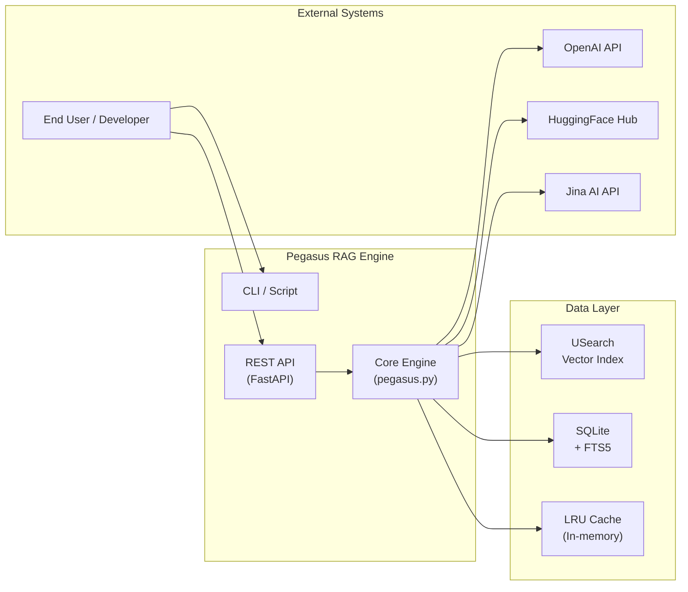
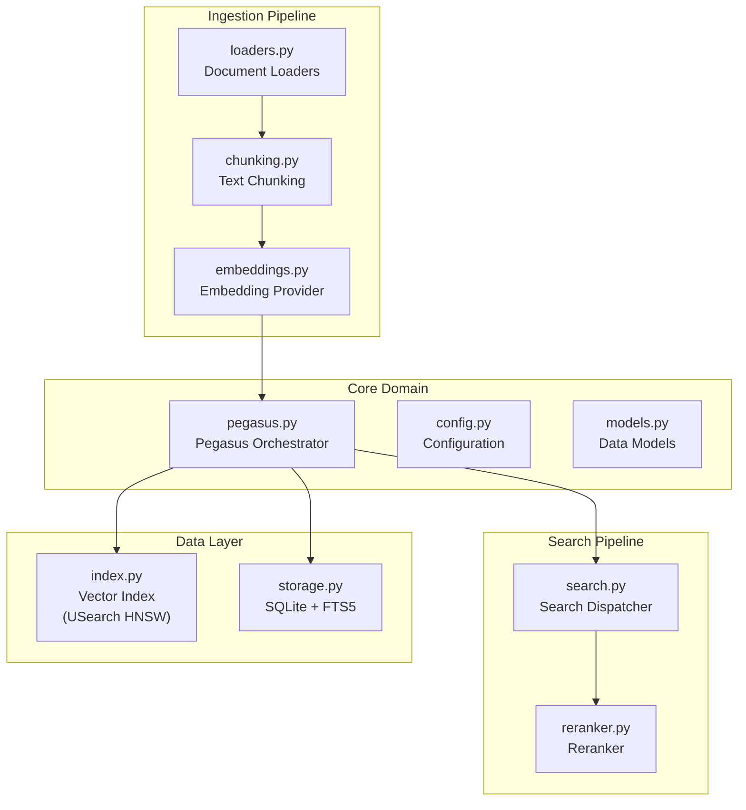
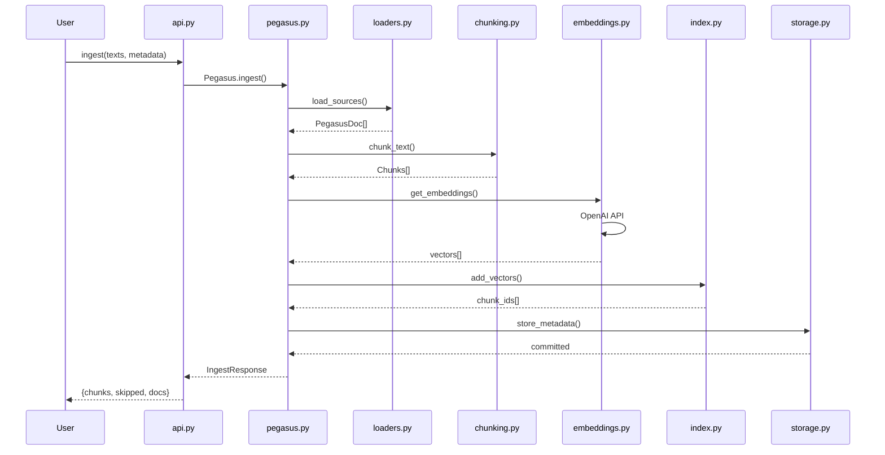
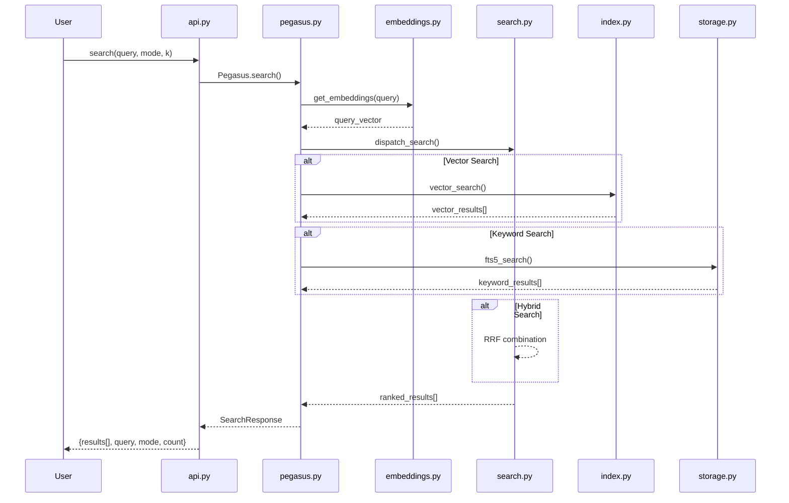
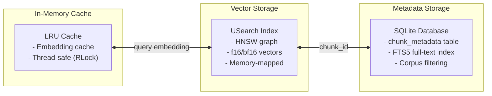
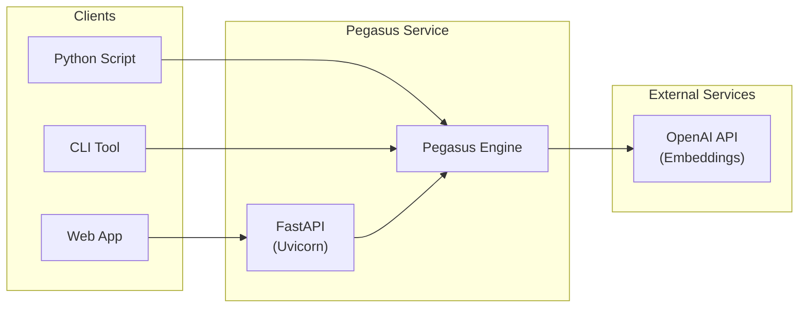

# Pegasus Codebase Architecture Diagram

**Project:** Pegasus v2 — High-Performance RAG Engine  
**Generated:** 2026-02-14  
**Purpose:** Executive-friendly overview of codebase organization and architecture

---

## 1. System Context Diagram

### Code Anchors

| Node | Path/Module | Description |
|------|-------------|-------------|
| `cli` | `pegasus/cli.py` | Command-line interface entry point |
| `api` | `pegasus/api.py` | FastAPI REST API server |
| `core` | `pegasus/pegasus.py` | Main orchestrator class |
| `openai` | `pegasus/embeddings.py` | OpenAI embedding provider |
| `usearch` | `pegasus/index.py` | USearch HNSW vector index |
| `sqlite` | `pegasus/storage.py` | SQLite + FTS5 metadata storage |

---

## 2. Codebase Architecture Diagram

### Code Anchors

| Node | Path | Responsibility |
|------|------|----------------|
| `loaders` | `pegasus/loaders.py` | Multi-source document loading (PDF, MD, URL, TXT) |
| `chunking` | `pegasus/chunking.py` | Sentence-aware text splitting with configurable overlap |
| `embeddings` | `pegasus/embeddings.py` | OpenAI/HF/Jina embedding providers with retry + batch |
| `pegasus` | `pegasus/pegasus.py` | Main orchestrator - threading, factory methods |
| `config` | `pegasus/config.py` | Immutable configuration schema |
| `models` | `pegasus/models.py` | Data classes (PegasusDoc, SearchResult) |
| `search` | `pegasus/search.py` | Search dispatcher (vector, keyword, hybrid modes) |
| `reranker` | `pegasus/reranker.py` | Result reranking |
| `index` | `pegasus/index.py` | USearch HNSW vector index manager |
| `storage` | `pegasus/storage.py` | SQLite + FTS5 metadata storage |

---

## 3. Request Lifecycle - Ingestion

---

## 4. Request Lifecycle - Search

---

## 5. Data Storage Architecture

---

## 6. Optional: Deployment View

---

## Legend

| Symbol | Meaning |
|--------|---------|
| `subgraph` | Logical grouping of related components |
| `-->` | Data/control flow direction |
| `A <--> B` | Bidirectional relationship |
| Solid border | Internal Pegasus components |
| Dashed border | External systems/services |

---

## Key Technologies

| Component | Technology |
|-----------|------------|
| Vector Search | USearch (HNSW, SIMD-accelerated) |
| Metadata Storage | SQLite + FTS5 |
| Embedding Providers | OpenAI, HuggingFace, Jina AI |
| REST API | FastAPI + Uvicorn |
| Thread Safety | Python RLock |
| Retry Logic | Tenacity (exponential backoff) |

---

## Unknowns / Assumptions

- **No message queues detected** - This is a synchronous RAG engine, no async job processing
- **Single-node deployment** - No distributed architecture in current version
- **No authentication layer** - API assumes trusted environment
- **Local file storage only** - No cloud storage integration (S3, etc.)

To verify: Check `pegasus/integration.py` for any additional external integrations.
